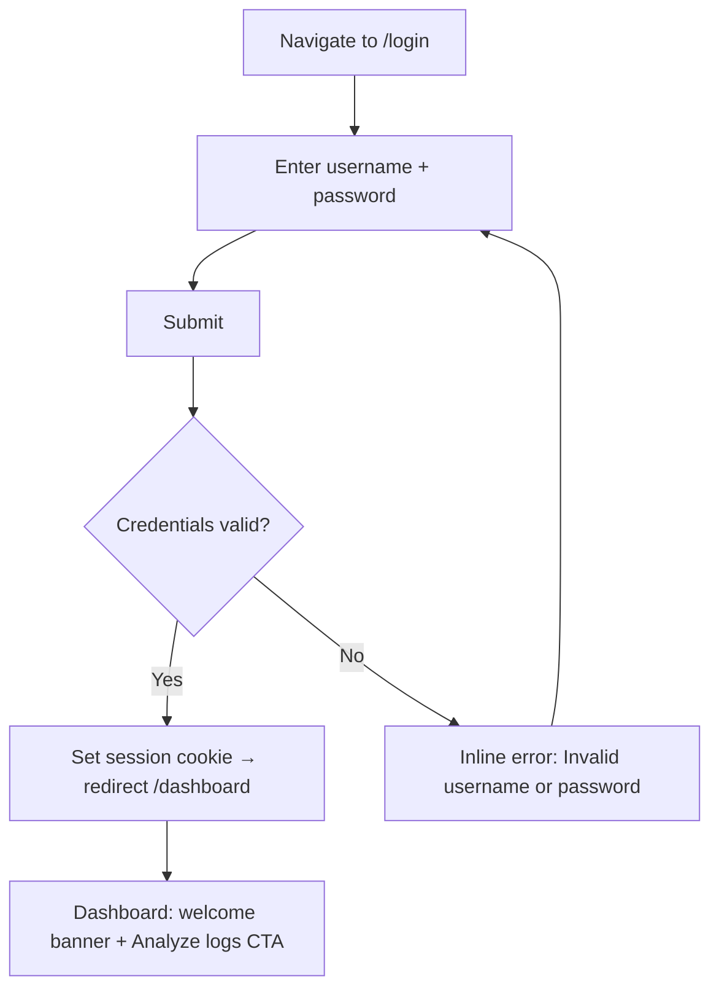

# UX Design Specification — nf-project (LogLens)

**Author:** Sebastian
**Date:** 2026-04-29

---

<!-- UX design content will be appended sequentially through collaborative workflow steps -->

## Executive Summary

### Project Vision

LogLens is a privacy-first, AI-assisted log analysis tool for engineers and SREs. The promise it makes to its users is: *"You can have AI-speed incident investigation without your secrets leaving your infrastructure."* That's not a feature — it's a trust contract, and the UX honours it at every moment a user touches the interface.

This is an internal engineering tool. Speed, clarity, and confidence are the UX north stars — not delight or visual richness.

### Target Users

**Alex — SRE, on-call engineer (primary)**: Reaches for LogLens at 2am during an incident. Every second of friction is a second of production pain. He needs the fastest possible path from "I have a log file" to "I understand what happened." He's technically fluent, impatient with unnecessary ceremony, and deeply distrustful of tools that might leak secrets.

**Priya — Platform engineer / admin (secondary)**: Sets up LogLens once for a team. She cares about the first-run wizard being correct and unambiguous — she won't be there to hand-hold when her colleagues use it. Trust in the security posture matters as much as the UI.

**Marco — Compliance-sensitive engineer (secondary)**: Uses the local LLM path. He actively looks at the redaction summary as a compliance signal, not just a step to skip. The redaction UI needs to feel like a genuine review, not a speed bump.

### Key Design Challenges

1. **Trust at the handoff point** — The moment between "my logs are scrubbed" and "confirm to send to LLM" is the most emotionally loaded moment in the product. The redaction review panel must communicate what was found *and* reassure the user that the dangerous content is gone. Too minimal = anxiety. Too verbose = it becomes noise that gets skipped.

2. **Pipeline opacity** — Four asynchronous stages (fetching → scrubbing → analysing → streaming) happen invisibly on the server. The progress UI must make the user feel *present* in a process happening elsewhere, not just waiting for a spinner to resolve. Each stage has a different quality of waiting: scrubbing is fast, LLM streaming can take 30–60 seconds.

3. **Results density vs. scanability** — The analysis output has five structured sections, each potentially long. An SRE at 2am will not read everything — they'll scan for the root cause and evidence excerpts first. Information hierarchy in the results view is critical.

4. **Minimal UI, maximum trust signal** — The app is bare HTML. Adding styling without over-designing is a real challenge: engineers trust austere, focused tools. Visual noise reads as untrustworthy. The UX spec communicates structure and hierarchy through layout intent, not decoration.

### Design Opportunities

1. **The redaction review as a trust moment** — Rather than a speed bump, the review panel is a genuinely reassuring confirmation: *"3 API keys and 12 emails removed — here's exactly what we found."* Done well, this becomes a reason users choose LogLens over alternatives.

2. **Live streaming as engagement** — Most analysis tools show a spinner, then a wall of text. A visible token stream building the analysis in real time turns waiting into watching. This is a meaningful UX differentiator.

3. **Error recovery as confidence** — When the pipeline fails, a clear, actionable error state with a single "Start over" path feels like the tool is on the user's side. Most tools abandon the user in error states.

## Core User Experience

### Defining Experience

The ONE core action: **Upload a log file → get a structured incident report in under 60 seconds.**

Everything else — setup, navigation, the review panel — exists to protect or enable that action. If that loop is fast and trustworthy, the product succeeds.

### Platform Strategy

- **Web, desktop-primary** — engineers at their workstations, wide viewport, keyboard-driven
- **Mouse + keyboard** — no touch considerations for v1; keyboard navigation is an accessibility requirement, not a nice-to-have
- **No offline mode** — all processing is server-side by design; the client is thin
- **Single persistent tab** — users don't open multiple LogLens windows; analysis state lives in one session

### Effortless Interactions

| Interaction | Why it must be effortless |
|---|---|
| Dropping a file onto the drop zone | The starting gun of every session — any friction here costs trust immediately |
| Reading the redaction summary | Marco needs to scan it in 5 seconds and feel confident; it cannot require interpretation |
| Scanning the Root Cause section | At 2am, Alex's eyes go straight here — it must be visually anchored above the noise |
| Resetting to start a new analysis | After results, re-running must be one click — no page reload, no lost state |

### Critical Success Moments

1. **First token arrives** — when the LLM stream begins and characters appear on screen, the user shifts from anxious waiting to active reading. This moment must feel immediate after confirming the review.
2. **Root cause surfaces** — the moment the hypothesis and evidence excerpts are visible in the structured output. This is the payoff of the entire pipeline.
3. **Redaction review relief** — seeing exactly what was removed and feeling safe to proceed. A poorly designed review panel destroys trust; a clear one builds it.
4. **"Start new analysis" after completion** — the clean slate moment. Completing a cycle and knowing you can immediately run another signals that the tool is reliable and repeatable.

### Experience Principles

1. **Speed is respect** — every unnecessary click, confirmation, or loading state disrespects the user's time. Default to the fastest path; add friction only where security requires it.
2. **Transparency earns trust** — the scrubbing pipeline, the LLM streaming, the structured evidence citations all make the black box visible. Never hide what the system is doing.
3. **Structure over decoration** — hierarchy and white space do the work that colour and illustration would do in a consumer app. The UI must be legible, not beautiful.
4. **One clear next action** — at every state in the pipeline, exactly one action should be obvious. Confusion is a bug.

## Desired Emotional Response

### Primary Emotional Goals

**Confident.** Not excited, not delighted — *confident*. The user needs to feel that they made the right call using this tool, that their data was handled correctly, and that the analysis output is worth acting on. Confidence is the emotion that converts a one-time user into a daily user.

**In control.** The scrubbing pipeline, the redaction review gate, the cancellation button — these all exist to give the user agency over a process that could otherwise feel like a black box. The UI must reinforce that the user is directing this analysis, not surrendering to it.

### Emotional Journey Mapping

| Stage | Target emotion | Risk emotion to avoid |
|---|---|---|
| Arriving at `/login` | Familiar, frictionless | Bureaucratic, locked-out |
| First-run wizard | Capable, not intimidated | Confused, unsure if I'm doing this right |
| Uploading a file | Ready, in motion | Uncertain if it worked |
| Watching scrubbing stages | Informed, present | Anxious, waiting blind |
| Redaction review panel | Reassured, in control | Sceptical ("did it really catch everything?") |
| LLM streaming begins | Engaged, watching | Frustrated, still waiting |
| Results: Root Cause section | Relieved, capable | Overwhelmed by wall of text |
| Starting a new analysis | Efficient, repeating | Fatigued by ceremony |

### Micro-Emotions

- **Trust over delight** — Alex doesn't want to be charmed; he wants to trust the output. Every interaction reinforces reliability.
- **Competence over ease** — the tool should feel like a sharp instrument, not a simplified one. Engineers feel respected when a tool doesn't dumb itself down.
- **Calm urgency** — at 2am during an incident, the UI must be calm without being slow. Active without being frantic.
- **Relief at the redaction panel** — not anxiety that something might have been missed, but the positive "ah, it caught all of that" reaction.

### Design Implications

| Emotion to create | UX design approach |
|---|---|
| Confidence in results | Evidence excerpts in blockquotes, explicit confidence badge, AI disclaimer banner |
| Control over the pipeline | Cancel button always visible and clearly labelled; explicit review gate before LLM call |
| Trust in scrubbing | Redaction summary shows categories and counts; not a vague "data scrubbed" message |
| Engaged during streaming | Token stream visible and scrolling; not just a spinner |
| Calm during waits | Pipeline progress shows which stage is active, not just "loading" |
| Competence when reading results | Dense information presented with strong visual hierarchy; sections clearly labelled |

### Emotional Design Principles

1. **Trust is earned, not assumed** — never tell the user the data is safe; *show* them what was removed.
2. **Silence anxiety with specificity** — vague status messages breed doubt; specific stage labels ("Scrubbing for PII and secrets…") replace anxiety with understanding.
3. **Respect the expert** — no hand-holding language, no excessive confirmations; treat the user as someone who knows what they're doing.
4. **Recovery without shame** — errors happen; the error state must feel like a neutral reset, not a failure.

## UX Pattern Analysis & Inspiration

### Inspiring Products Analysis

**GitHub (PRs, commit diffs, Actions workflow views)** — Engineers spend hours in GitHub. Its UX teaches: dense information with strong structural hierarchy works when typography and spacing are deliberate. The Actions checks view — stages with ✓/✗/spinner states — is exactly the mental model that maps to LogLens's pipeline progress. Monospace code blocks are universally trusted for technical data.

**Linear (issue tracker)** — Linear taught engineers that a minimal, keyboard-first tool can be genuinely clean without being decorative. It uses generous whitespace, a narrow fixed content column, and muted status colours to create hierarchy without noise. Its empty states feel like invitations, not failures.

**Grafana (dashboards, log explorer)** — The primary context where Alex lives during incidents. Grafana's log explorer uses a clean layout: query/controls separate from results. Its log line presentation (monospace, time-stamped) sets the mental expectation for how log data should look. LogLens results should feel familiar to Grafana users — not alien.

**Vercel deploy logs** — The closest reference for "live streaming output in an engineering tool." Vercel's build log stream — monospace, scrolling — turns a waiting moment into an active one. The terminal aesthetic signals "this is real work happening."

### Transferable UX Patterns

**Navigation patterns:**
- Minimal top nav (GitHub, Linear) — one horizontal bar with brand + links + user menu; no sidebars for v1
- Active route indicator — subtle underline or colour change on current nav item

**Pipeline / progress patterns:**
- Vertical stage list with status icons (GitHub Actions) — ✓ done / spinner active / — pending — maps perfectly to LogLens's 4 stages
- Stage label precision — "Scrubbing for PII and secrets…" not "Processing…"

**Data presentation patterns:**
- Monospace font for log excerpts, evidence citations, and the live token stream (Grafana, Vercel)
- Border-left blockquote pattern for cited evidence — visually distinct from analysis prose
- Section heading + count badge for errors (e.g. "Errors & Frequency — 4 found")

**Form and input patterns:**
- Drag-and-drop zone with visible feedback on hover — bordered dashed area, changes on drag-over
- Inline field validation — error appears below the relevant field, not in a toast

**Status and feedback patterns:**
- Specific stage labels, not generic spinners
- `role="alert"` inline errors, not modal interruptions
- Streaming text that auto-scrolls

### Anti-Patterns to Avoid

- **Modal confirmations for non-destructive actions** — friction that destroys trust under pressure
- **Toast notifications for pipeline state** — pipeline stages belong in a persistent tracker, not ephemeral toasts
- **Full-page loaders** — the UI must remain interactive; spinners that block the viewport are wrong here
- **Accordion-collapsed results by default** — SREs in an incident won't click to expand; root cause must be visible immediately
- **Colour as the only status differentiator** — always pair colour with a text label or icon (WCAG NFR23)

### Design Inspiration Strategy

**Adopt:**
- GitHub Actions vertical stage list with ✓/spinner/— icons → `PipelineProgress`
- Vercel live log stream aesthetic → token stream area (monospace, scrollable)
- Linear's content column width discipline → single-column constrained layout for all screens

**Adapt:**
- GitHub's blockquote evidence style → apply to LLM evidence citations in `AnalysisOutput`

**Avoid:**
- Consumer SaaS onboarding patterns (modals, tooltips, guided tours) — wrong audience
- Dashboard-style card grids — LogLens has one workflow; cards imply multiple parallel choices

## Design System Foundation

### Design System Choice

**shadcn/ui + Tailwind CSS** (with Radix UI primitives under the hood).

### Rationale for Selection

1. **Radix UI primitives** — keyboard navigation, ARIA roles, focus management, and screen reader compatibility are solved by default. WCAG 2.1 AA requirements (NFR20–NFR23) become dramatically easier to satisfy.
2. **You own the code** — shadcn/ui copies components into the codebase; there is no black-box library to fight. Each component is editable, testable, and fully in developer control.
3. **No visual opinions imposed** — the default shadcn theme is neutral and professional; it looks like a serious internal tool without decoration.
4. **Tailwind enforces consistent spacing and hierarchy** — the grid and spacing scale enforces visual rhythm without requiring a designer for every pixel.
5. **Zero-friction stack integration** — the project is already Vite + React + TypeScript; shadcn/ui integrates without additional bundler configuration.
6. **Monospace and blockquote areas** — trivially styled with Tailwind utilities; no fighting a component library's opinions for the token stream and evidence citations.

### Implementation Approach

- Install Tailwind CSS + shadcn/ui CLI as part of story 6.1 (app shell)
- Baseline component set: `Button`, `Input`, `Label`, `Badge`, `Separator`, `Alert`
- Add `cn()` utility (clsx + tailwind-merge) for conditional class composition
- Define CSS custom properties for semantic status colours: success (green), warning (amber), error (red), muted (grey/zinc) — applied consistently across `PipelineProgress`, `AnalysisOutput`, error states

### Customisation Strategy

- **Colour palette**: neutral base (zinc or slate), one brand accent chosen by developer (teal or indigo suit a privacy/security tool)
- **Typography**: `font-sans` (system stack) for UI prose; `font-mono` (system monospace) for log data, token stream, and evidence blockquotes
- **Spacing**: Tailwind default scale; no custom spacing values needed for v1
- **No dark mode for v1** — not in requirements; adds implementation complexity without user value at this stage

## Core Interaction Design

### Defining Experience

> **"Drop a log file. Watch it get scrubbed. Confirm. Watch the analysis build itself."**

The magic isn't just the result — it's the *visible pipeline*. Unlike every other log analysis tool that returns a wall of text after an invisible wait, LogLens makes each stage of the process observable. That's the novel pattern users will describe to colleagues.

### User Mental Model

Alex already understands CI/CD pipelines — he watches GitHub Actions stages tick through every day. When he sees LogLens's progress indicator (Fetching → Scrubbing → Analysing → Complete), he doesn't need to learn anything new.

The redaction review gate is the one moment where LogLens deviates from the CI analogy: it's a *human* gate, not an automated one. That deliberate pause is the trust signal — "You are in control of what goes to the LLM. We won't proceed without you."

**What users bring:**
- Mental model: "run a pipeline, get a report"
- Expectation: fast (sub-60s), specific (cite actual lines), honest about uncertainty
- Frustration with alternatives: manual grep takes 20+ minutes; other AI tools send raw logs to external servers with no visibility

### Success Criteria

| Criterion | What "working" looks like |
|---|---|
| Speed | First token within 5s of confirming review; full analysis under 60s |
| Specificity | Root cause cites actual log lines in blockquotes; not a generic summary |
| Trust | Redaction review shows exactly what was removed — user can read and nod |
| Confidence | AI disclaimer visible but does not undermine the output |
| Recoverability | Single "Start new analysis" click resets to a clean state |

### Novel UX Patterns

**What's established and familiar:**
- File drop zone (universal upload UI)
- Pipeline stage progress (GitHub Actions, Vercel)
- Streaming output (Vercel logs, terminal)

**What's novel:**
- The **redaction review gate** — no other tool shows users what was stripped before sending to AI
- **Privacy as a first-class UI element** — the scrubbing result is a full review panel the user must consciously pass through

**How to teach the novel pattern:** The panel heading does the work — *"Review before analysis — the following content was removed before sending to the LLM."* One sentence. No tutorial needed.

### Experience Mechanics

**Initiation:** Drop zone is the dominant element on `/analysis`; "Analyze logs" button disabled until a file is chosen — zero ambiguity about the next action.

**Interaction:** Drop file → file name + size shown, button enables → click "Analyze logs" → pipeline ticks through → redaction review appears → user reads category counts, clicks "Confirm and analyze" → LLM stream begins.

**Feedback:** Each pipeline stage has its own label and status icon. Streaming token area confirms analysis started; it auto-scrolls. Structured output sections appear below stream on complete.

**Completion:** "Analysis complete" stage ticks ✓. Five structured sections visible; "Start new analysis" is the single clear next action.

## Visual Design Foundation

### Colour System

**Base palette: Zinc (neutral) + Teal (accent)**

Zinc is the backbone of GitHub, Linear, and most tools engineers trust. It's not cold like pure grey, not warm like stone — it's the neutral that says "this tool means business." Teal as an accent signals precision and calm authority — used in security tooling precisely because it reads as trustworthy without being aggressive.

| Token | Tailwind value | Usage |
|---|---|---|
| `background` | `zinc-50` | Page background |
| `surface` | `white` | Cards, panels |
| `border` | `zinc-200` | Borders, dividers |
| `text-primary` | `zinc-900` | Headings, labels |
| `text-secondary` | `zinc-500` | Subtitles, hints |
| `text-muted` | `zinc-400` | Disabled states, placeholders |
| `accent` | `teal-600` | Primary buttons, active nav link |
| `accent-hover` | `teal-700` | Button hover |
| `success` | `green-600` | Pipeline stage ✓ complete |
| `active` | `blue-500` | Pipeline stage … in progress |
| `warning` | `amber-500` | AI disclaimer banner |
| `error` | `red-600` | Error states, pipeline failure |

All text/background pairings meet WCAG AA: zinc-900 on zinc-50 ≈ 15:1; teal-600 on white ≈ 4.7:1. Colour is never the only status differentiator — every state uses icon + colour + label.

### Typography System

| Role | Tailwind class | When |
|---|---|---|
| Page heading (h1) | `text-2xl font-semibold` | Screen titles |
| Section heading (h2) | `text-lg font-semibold` | Result sections, panel headings |
| Sub-heading (h3) | `text-base font-medium` | Stage labels, form group labels |
| Body | `text-sm` (14px) | Descriptions, paragraph text |
| Small / hint | `text-xs text-zinc-500` | Password hints, format notes, file size |
| Monospace | `font-mono text-sm` | Token stream, log excerpts, evidence blockquotes, file name |
| Badge / label | `text-xs font-semibold` | Confidence badge, redaction type tags |

Line height: `leading-relaxed` for body prose; `leading-snug` for dense technical content.

### Spacing & Layout Foundation

**Content column:** `max-w-3xl` (48rem) centred — focused without feeling cramped. Auth screens (`/login`, `/setup`): `max-w-sm` centred column.

**Base unit:** 4px (Tailwind default). Standard gaps: `gap-4` (16px) between sections, `gap-2` (8px) between related elements, `gap-1` (4px) within tightly coupled pairs.

**Header:** Fixed `h-14`, full-width, `border-b border-zinc-200`, `px-6`.

**Page content:** `pt-8 pb-16 px-6` — breathing room from header, generous bottom padding.

**Drop zone:** Minimum `h-40`, dashed border, `rounded-lg`.

**Pipeline progress:** Vertical list `space-y-2`; each row `flex items-center gap-3`.

### Accessibility Considerations

- Minimum 44×44px touch target on all interactive elements
- Focus rings: `ring-2 ring-teal-600 ring-offset-2` (shadcn/ui default handles most of this)
- `role="alert"` on error messages; `role="status"` on pipeline progress
- `aria-live="polite"` on pipeline progress container; `aria-live="assertive"` on error states
- All status states: icon + colour + label — colour never the sole differentiator

## Design Direction Decision

### Design Directions Explored

Three conceptual directions were assessed:

1. **"Engineering Dashboard"** — Sidebar nav, dense data tables, monospace-heavy. *Rejected*: sidebar adds nav complexity with no value in a 2-screen product.
2. **"Consumer SaaS"** — Rounded cards, gradient accents, illustrations. *Rejected*: misaligned with engineering audience; undermines trust in a security tool.
3. **"Focused Tool"** — Topbar-only nav, centred narrow column, progressive disclosure, monospace/sans register split. *Selected.*

### Chosen Direction: Focused Tool

A purposeful, single-task interface. Every screen has one primary action. Visual hierarchy directs attention to what matters in each moment.

**Key characteristics:**

- **Topbar only** — `h-14` header with logo and username; no sidebar, drawer, or bottom nav
- **Centred narrow column** — `max-w-3xl` for content, `max-w-sm` for auth
- **Progressive disclosure** — upload card is the only active element until a file is chosen; action button enables only then
- **Monospace for data, sans for UI** — clear visual register shift signals machine output vs. interface copy
- **Minimal chrome** — no gradients, no decorative elements, `shadow-sm` only on cards
- **Functional colour** — teal used sparingly for primary CTA and active state; status colours reserved for state communication only

### Design Rationale

LogLens's core promise is clarity in complexity. The UI must embody that promise. A cluttered or decorative interface would contradict the product's reason for existing.

The "Focused Tool" direction eliminates navigation decisions that don't exist (only 2 screens), creates visual calm that makes the pipeline progress the hero, and uses contrast as semantic signal rather than decoration.

### Implementation Approach

1. Install shadcn/ui components via CLI — each component is locally owned
2. Extend `tailwind.config` with semantic token aliases from the colour table (or use Tailwind values directly for v1)
3. Set `font-sans` via `body` class; apply `font-mono` at component level
4. Build `AppShell` (story 6.1) as the layout anchor — all other screens compose inside it

## User Journey Flows

### Journey 1: First-Run Setup

```mermaid
flowchart TD
    A[Navigate to app for first time] --> B{Setup complete?}
    B -- No --> C[/setup — Step 1: Create admin username]
    C --> D[Step 2: Create password]
    D --> E[Step 3: Configure LLM provider + API key]
    E --> F[Step 4: Test connection]
    F --> G{Connection OK?}
    G -- Yes --> H[Mark setup complete → redirect /login]
    G -- No --> I[Show inline error below API key field]
    I --> E
    B -- Yes --> J[Redirect /login]
```

- Steps are sequential within a single multi-step form — no separate routes per step
- "Back" button available from step 2 onwards; never destructive (fields preserved in state)
- Final step shows "✓ Connected" badge before enabling "Finish setup" CTA
- If user navigates away mid-setup and returns, resume at last completed step

### Journey 2: Login



- No "forgot password" for v1 — single-user local tool
- Error message is deliberately vague; does not distinguish wrong username from wrong password
- On success, redirect target is always `/dashboard`

### Journey 3: Log Analysis (Primary Flow)

```mermaid
flowchart TD
    A[/analysis page loads] --> B[Drop zone shown — button disabled]
    B --> C{File selected?}
    C -- Drop or browse --> D[File name + size shown — button enables]
    D --> E[Click Analyze logs]
    E --> F[Pipeline: Uploading...]
    F --> G[Pipeline: Scrubbing...]
    G --> H[Redaction review panel appears]
    H --> I{User reviews redactions}
    I -- Confirm and analyze --> J[Pipeline: Analysing...]
    J --> K[Token stream begins — auto-scroll]
    K --> L[Pipeline: Complete]
    L --> M[Structured results visible below stream]
    M --> N[Click Start new analysis]
    N --> B
    I -- Cancel --> O[Reset to drop zone]
    F -- Error --> P[Pipeline stage shows error]
    P --> Q[Error message + retry option]
    Q --> B
```

- "Analyze logs" button disabled until file selected — affordance prevents the error state
- Redaction review is a mandatory gate; cannot proceed without explicit confirm
- Cancel at review gate returns to clean drop zone — full reset, not a back nav
- Pipeline stages are sequential and all remain visible above the current active stage
- "Start new analysis" is the only CTA shown after completion

### Journey Patterns

| Pattern | Description | Applied in |
|---|---|---|
| **Gated progression** | Next action available only after current step is complete | File → button enable; Review → confirm before analyse |
| **Inline state** | Error/success feedback adjacent to the triggering element | Login error below form; pipeline stage error inline |
| **Single primary CTA** | Only one enabled action per state | Drop zone, Review gate, Completion screen |
| **Progressive reveal** | New elements appear only when relevant | Pipeline stages activate sequentially; results appear on complete |
| **Destructive reset** | Cancel returns to the very beginning, not a previous step | Cancel at review → clean drop zone |

### Flow Optimisation Principles

- **Steps to first value:** Drop file → click Analyze → click Confirm — three interactions to first LLM token
- **Feedback latency:** Every click produces a visible response within 100ms (button loading state, stage label update)
- **Irreversibility signals:** "Confirm and analyze" wording makes it clear the user is about to send data to an LLM
- **Recovery paths:** Every error state has a clear next action — retry or reset, never a dead end

## Component Strategy

### Design System Components (shadcn/ui — use as-is)

| Component | Usage |
|---|---|
| `Button` | Primary CTA, secondary actions, ghost/outline variants |
| `Input` | Username, password, API key fields |
| `Label` | Form field labels |
| `Card` | Drop zone wrapper, analysis result sections, setup step container |
| `Badge` | Confidence level indicator, redaction type tags |
| `Separator` | Section dividers in structured output |
| `Alert` | AI disclaimer banner, connection error messages |
| `Select` | LLM provider dropdown in setup wizard |
| `ScrollArea` | Token stream scrollable container |
| `Tooltip` | Redaction category explanation on hover |

### Custom Components

**`DropZone`**
- **Purpose:** File selection via drag-and-drop or click-to-browse
- **Anatomy:** Dashed border card, upload icon, "Drop a log file here" label, "or browse" link, format hint
- **States:** `idle` (dashed border), `drag-over` (teal border + bg tint), `file-selected` (file name + size + remove ×), `uploading` (replaced by pipeline)
- **Accessibility:** `role="button"`, `aria-label="Upload log file"`, Enter/Space triggers file picker

**`PipelineProgress`**
- **Purpose:** Visualises the 4-stage pipeline with per-stage status
- **Anatomy:** Vertical list; each row: `[status icon] [stage label] [optional error sub-label]`
- **Stages:** Uploading → Scrubbing → Analysing → Complete
- **States per stage:** `pending` (muted), `active` (spinner + teal), `complete` (green ✓), `error` (red ✗ + message)
- **Accessibility:** `role="status"`, `aria-live="polite"`, each stage `aria-label` includes its state

**`RedactionReviewPanel`**
- **Purpose:** Privacy gate — shows what was scrubbed before proceeding to LLM
- **Anatomy:** Panel heading, category summary (e.g. "3 email addresses, 1 API key removed"), expandable redacted value list (type + placeholder only, never original value), "Confirm and analyze" (primary) + "Cancel" (ghost)
- **States:** `reviewing` (both buttons enabled), `confirming` (both disabled, spinner on confirm)
- **Accessibility:** `role="region"`, `aria-label="Redaction review"`, focus moves to panel on appear

**`TokenStream`**
- **Purpose:** Displays LLM output tokens as they stream
- **Anatomy:** Scrollable monospace container, auto-scrolls to bottom, "Cancel" button overlaid top-right
- **States:** `streaming` (cursor blink), `complete` (cursor removed), `cancelled` (faded + label)
- **Accessibility:** `aria-live="polite"`, `aria-label="Analysis output"`, `tabindex="0"` on scroll container

**`AnalysisResultSection`**
- **Purpose:** Renders one of the 5 structured output sections
- **Anatomy:** `h2` heading, optional confidence `Badge`, prose content, evidence `<blockquote>` in monospace
- **States:** `loading` (skeleton), `populated`
- **Accessibility:** Heading hierarchy maintained; blockquotes use `<blockquote>` element

**`AppHeader`**
- **Purpose:** Fixed topbar with logo and user identity
- **Anatomy:** `h-14` bar, logo left-aligned, username + logout button right-aligned
- **States:** `authenticated` (username + logout), `unauthenticated` (logo only — on `/login` and `/setup`)
- **Accessibility:** `<header role="banner">`, logout is a `<button>`

**`StepIndicator`**
- **Purpose:** Multi-step setup wizard progress
- **Anatomy:** Numbered circles connected by lines; active step in teal
- **States per step:** `complete` (filled + ✓), `active` (teal fill), `pending` (outline)
- **Accessibility:** `aria-label="Step X of Y"` on each indicator

### Component Implementation Strategy

1. Scaffold shadcn/ui primitives via CLI — generates owned code in `src/components/ui/`
2. Build custom components in `src/components/` — one file per component
3. Custom components consume shadcn/ui primitives and Tailwind tokens only — no raw CSS
4. Icons: Lucide React (already a shadcn/ui peer dependency)

### Implementation Roadmap

**Phase 1 — Layout and auth (stories 6.1, 6.2):** `AppHeader`, `StepIndicator`, + shadcn/ui `Input`, `Button`, `Label`, `Card`

**Phase 2 — Analysis flow (stories 6.3, 6.4):** `DropZone`, `PipelineProgress`, `RedactionReviewPanel`

**Phase 3 — Results display (story 6.5):** `TokenStream`, `AnalysisResultSection`, + shadcn/ui `Badge`, `ScrollArea`, `Alert`

## UX Consistency Patterns

### Button Hierarchy

| Variant | shadcn/ui | When |
|---|---|---|
| Primary | `Button` default | One per screen — the single next action |
| Secondary | `Button variant="outline"` | Supporting action (Cancel, Back) |
| Ghost | `Button variant="ghost"` | Low-emphasis (Browse files link-style) |
| Disabled | `disabled` prop | When preconditions not met — visible, never hidden |

- Never more than one primary button visible at a time
- Disabled buttons stay in DOM and visible — they teach the precondition
- Loading state: spinner + label change, width fixed to avoid layout shift

### Feedback Patterns

| Situation | Component | Placement |
|---|---|---|
| Field error | `<p className="text-xs text-red-600">` | Below the field |
| Form-level error | `Alert variant="destructive"` | Top of form |
| Pipeline error | Inline in `PipelineProgress` stage row | Adjacent to failed stage |
| AI disclaimer | `Alert variant="warning"` | Below stream/results — persistent |
| Connection test success | Green `Badge` "✓ Connected" | Adjacent to test button |
| Connection test failure | Inline message | Below API key field |

- Errors are always inline — no toast notifications for v1
- Error messages are actionable: state what to do, not just what failed
- Success states redirect where appropriate; inline success persists until next action

### Form Patterns

- **Field layout:** Label above → field → hint text (muted `text-xs`) → error text (red `text-xs`)
- **Validation timing:** On blur for format errors; on submit for required fields — never on keystroke
- **Password fields:** Always include show/hide toggle (`Eye`/`EyeOff` Lucide)
- **Multi-step form:** State held in component memory; Back preserves values; only final step submits; Enter advances current step

### Navigation Patterns

- **Active state:** `teal-600` text + `font-medium` — no underline, no background pill
- **Logout:** Plain text button in header; no confirmation modal for v1
- **Route guards:** Silent redirect — destination page explains itself

### Loading & Empty States

- **Skeletons** for content that will appear (result sections while streaming)
- **Spinner inside button** for in-flight actions — button disabled, label changes
- **`PipelineProgress` replaces drop zone** while processing — no overlay
- **Dashboard empty:** welcome message + large CTA — no illustration needed
- **`/analysis` initial:** drop zone is the empty state and the instruction

### Error Recovery

1. **Inline correction** — form validation lets users fix without losing context
2. **Retry** — pipeline errors restart from the failed stage
3. **Full reset** — "Start new analysis" / "Cancel" returns to clean drop zone

No dead ends: every error exposes at least one forward path.

## Responsive Design & Accessibility

### Responsive Strategy

**Platform commitment: desktop-first.** The PRD targets developers at a workstation. The analysis workflow — file drop, reviewing redaction details, reading structured output — is poorly suited to mobile. v1 does not attempt mobile optimisation.

- Layouts designed for 1024px+ viewports
- Tailwind breakpoints used for graceful degradation at smaller sizes, not polished mobile layouts
- No bottom navigation, gesture interactions, or mobile layout branches for v1

### Breakpoint Strategy

| Breakpoint | Tailwind prefix | Behaviour |
|---|---|---|
| `< 640px` | (default) | Stacked layout, reduced padding — readable but not optimised |
| `640px–1023px` | `sm:` | Centred column works; minor spacing adjustments |
| `≥ 1024px` | `lg:` | Primary design target |

`max-w-3xl` centred column works from tablet upwards. On `< sm`: `px-4` instead of `px-6`; no width cap needed.

### Accessibility Strategy

**Target: WCAG 2.1 Level AA** (required by NFR20–23 in PRD).

| Requirement | Implementation |
|---|---|
| Colour contrast | All pairs meet 4.5:1 (normal) / 3:1 (large) — verified in colour system |
| Keyboard navigation | Radix UI primitives (via shadcn/ui) + explicit `tabindex` and key handlers on custom components |
| Focus indicators | `ring-2 ring-teal-600 ring-offset-2` on all focusable elements |
| Screen reader support | Semantic HTML throughout; ARIA only where HTML semantics are insufficient |
| Touch targets | Minimum 44×44px on all interactive elements |
| Skip link | `<a href="#main-content" className="sr-only focus:not-sr-only">Skip to main content</a>` in `AppHeader` |
| Live regions | `aria-live="polite"` on pipeline progress; `aria-live="assertive"` on error alerts |
| Form labels | Every input has an associated `<label>` — no placeholder-only fields |
| Reduced motion | Animations respect `prefers-reduced-motion` — fallback to static state indicators |

### Testing Strategy

**Automated (CI-integrated):**
- `@axe-core/playwright` in the existing Playwright e2e suite — catches ~30–40% of WCAG violations automatically

**Manual (developer responsibility):**
- Keyboard-only navigation: Tab through all flows, confirm no traps
- VoiceOver (macOS) smoke test on primary flow
- Colour contrast check on any new colour combinations

**Browser targets:** Chrome, Firefox, Safari — current stable versions.

### Implementation Guidelines

- Semantic HTML before ARIA — `<button>` not `<div onClick>`
- Never remove focus outline; only restyle it
- `aria-describedby` links fields to hint/error text
- `aria-disabled="true"` on disabled buttons (not just HTML `disabled`) for screen reader clarity
- `DropZone`: file input visually hidden but in DOM; visible drop area is a `<button>` that triggers it
